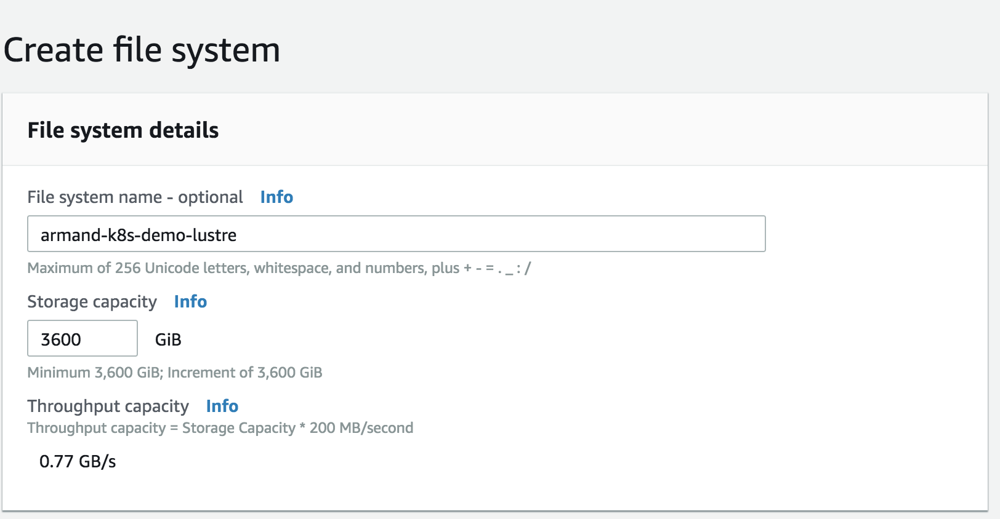
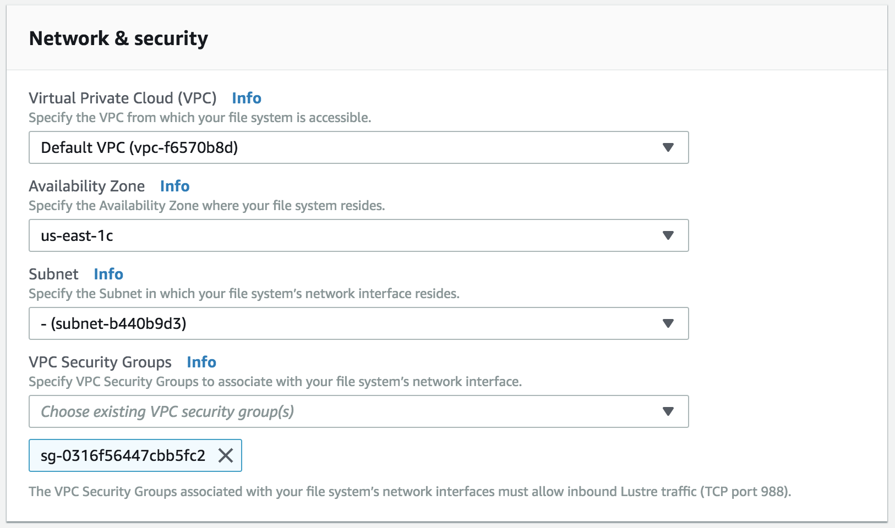
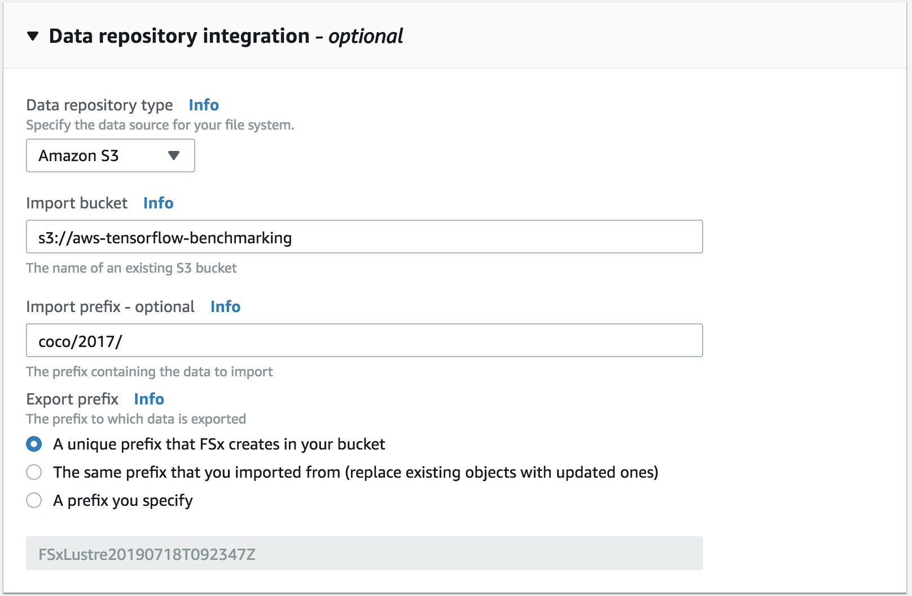
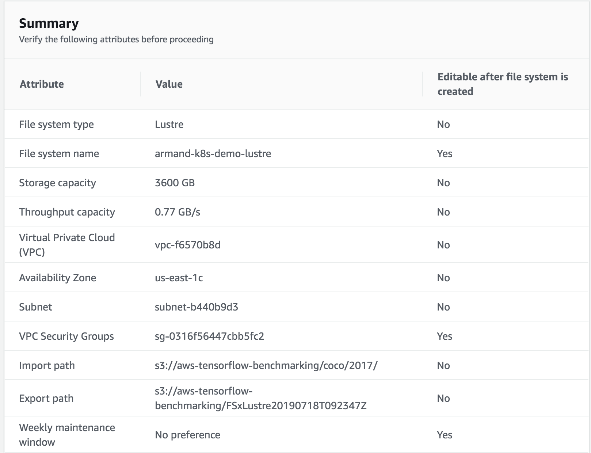

# Practical Introduction to Distributed Training on Kubernetes

### 1. Install `eksctl`.
 
`eksctl` is a tool that makes it easy to create and add nodes to an EKS cluster.

```
brew tap weaveworks/tap
brew install weaveworks/tap/eksctl
```

NOTE: These instructions were tested with 0.1.40. The 0.1.X version changes introduce breaking changes and instructions may need to be updated for newer versions. To download 0.1.40, you can download the binary from [here](https://github.com/weaveworks/eksctl/releases/tag/0.1.40)

### 2. Launch the EKS cluster with `eksctl`. 

This will create the EKS cluster (the master nodes). This may take 20+ minutes. 

```
eksctl create cluster -f cluster_config.yaml --auto-kubeconfig
```

<details><summary>Command Output</summary>
<p>

```
$ eksctl create cluster -f cluster_config.yaml --auto-kubeconfig
[ℹ]  using region us-east-1
[✔]  using existing VPC (vpc-f6570b8d) and subnets (private:[] public:[subnet-58b35b04 subnet-b440b9d3 subnet-21ac2f2e])
[!]  custom VPC/subnets will be used; if resulting cluster doesn't function as expected, make sure to review the configuration of VPC/subnets
[ℹ]  using Kubernetes version 1.13
[ℹ]  creating EKS cluster "armand-demo-cluster" in "us-east-1" region
[ℹ]  will create a CloudFormation stack for cluster itself and 0 nodegroup stack(s)
[ℹ]  if you encounter any issues, check CloudFormation console or try 'eksctl utils describe-stacks --region=us-east-1 --name=armand-demo-cluster'
[ℹ]  1 task: { create cluster control plane "armand-demo-cluster" }
[ℹ]  building cluster stack "eksctl-armand-demo-cluster-cluster"
[ℹ]  deploying stack "eksctl-armand-demo-cluster-cluster"
[✔]  all EKS cluster resource for "armand-demo-cluster" had been created
[✔]  saved kubeconfig as "/Users/armanmcq/.kube/eksctl/clusters/armand-demo-cluster"
[ℹ]  kubectl command should work with "/Users/armanmcq/.kube/eksctl/clusters/armand-demo-cluster", try 'kubectl --kubeconfig=/Users/armanmcq/.kube/eksctl/clusters/armand-demo-cluster get nodes'
[✔]  EKS cluster "armand-demo-cluster" in "us-east-1" region is ready
```

</p>
</details>

<details><summary>More Details</summary>
<p>

- An EKS cluster (the master nodes) is very cheap ($0.20 per hour). 
  - You may want to leave the cluster always running and just remove the GPU worker nodes when you aren't using it.
- `--auto-kubeconfig` is a personal preference. It writes the kubeconfig to a separate file instead of adding it to the main kubeconfig file. See more here:
  - [Creating and Managing Cluster with `eksctl`](https://eksctl.io/usage/creating-and-managing-clusters/)
  - [Organizing Cluster Access Using kubeconfig Files](https://kubernetes.io/docs/concepts/configuration/organize-cluster-access-kubeconfig/)

</p>
</details>


### 3. Launch the the worker nodes with `eksctl`. This will launch the EC2 instances and connect them to the k8s cluster. 

```
eksctl create nodegroup -f nodegroup_config.yaml
```

<details><summary>Command Output</summary>
<p>

```
$ eksctl create nodegroup -f nodegroup_config.yaml
[ℹ]  using region us-east-1
[ℹ]  will use version 1.13 for new nodegroup(s) based on control plane version
[ℹ]  nodegroup "nodegroup-p3dn" will use "ami-0017d945a10387606" [AmazonLinux2/1.13]
[ℹ]  using EC2 key pair "us-east-1-armanmcq-tf-neo"
[ℹ]  1 nodegroup (nodegroup-p3dn) was included
[ℹ]  will create a CloudFormation stack for each of 1 nodegroups in cluster "armand-demo-cluster"
[ℹ]  1 task: { create nodegroup "nodegroup-p3dn" }
[ℹ]  building nodegroup stack "eksctl-armand-demo-cluster-nodegroup-nodegroup-p3dn"
[ℹ]  --nodes-min=4 was set automatically for nodegroup nodegroup-p3dn
[ℹ]  --nodes-max=4 was set automatically for nodegroup nodegroup-p3dn
[ℹ]  deploying stack "eksctl-armand-demo-cluster-nodegroup-nodegroup-p3dn"
[ℹ]  adding role "arn:aws:iam::578276202366:role/eksctl-armand-demo-cluster-nodegr-NodeInstanceRole-LIO93J931ALY" to auth ConfigMap
[ℹ]  nodegroup "nodegroup-p3dn" has 0 node(s)
[ℹ]  waiting for at least 4 node(s) to become ready in "nodegroup-p3dn"
[ℹ]  nodegroup "nodegroup-p3dn" has 4 node(s)
[ℹ]  node "ip-172-31-1-72.ec2.internal" is ready
[ℹ]  node "ip-172-31-15-97.ec2.internal" is ready
[ℹ]  node "ip-172-31-3-4.ec2.internal" is ready
[ℹ]  node "ip-172-31-8-106.ec2.internal" is ready
[ℹ]  as you are using a GPU optimized instance type you will need to install NVIDIA Kubernetes device plugin.
[ℹ]      see the following page for instructions: https://github.com/NVIDIA/k8s-device-plugin
[✔]  created 1 nodegroup(s) in cluster "armand-demo-cluster"
[ℹ]  checking security group configuration for all nodegroups
[ℹ]  all nodegroups have up-to-date configuration
```

</p>
</details>

<details><summary>More Details</summary>
<p>


- `eksctl` calls this a nodegroup. You could have multiple nodegroup - one with GPU instances, another with CPU instances for example. 
- You can do this as part of the `eksctl create cluster` step by adding the `nodegroup_config.yaml` info to `cluster_config.yaml`.

</p>
</details>


### 3. Set the KUBECONFIG

The kubeconfig file holds information and credentials for your cluster(s). You need to tell `kubectl` to use the kubeconfig for the cluster we just created by setting the `KUBECONFIG` environment variable.


```
export KUBECONFIG=~/.kube/eksctl/clusters/armand-demo-cluster
```

<details><summary>More Details</summary>
<p>


- Process would be different if we were not using `--auto-kubeconfig`. If you store info for multiple cluster on the main kubeconfig file (`~/.kube/config`), you will need to use the [`kubectl config`](https://kubernetes.io/docs/tasks/access-application-cluster/configure-access-multiple-clusters/) command.

</p>
</details>

### 4. Install NVIDIA device plugin

This tells enables GPU support in k8s.

```
kubectl create -f https://raw.githubusercontent.com/NVIDIA/k8s-device-plugin/1.0.0-beta/nvidia-device-plugin.yml
```

<details><summary>More Details</summary>
<p>


- This is a DaemonSet that runs on each node. It allows you to automatically:
    - Expose the number of GPUs on each nodes of your cluster
    - Keep track of the health of your GPUs
    - Run GPU enabled containers in your Kubernetes cluster.
- https://github.com/NVIDIA/k8s-device-plugin

</p>
</details>


### 4. Set up FSx for Lustre

We will be storing data and logs on on FSx.

First we need to create a security group

<details><summary>Screenshots</summary>
<p>



The above security group is the one we created with `lustre_security_group.py`



</p>
</details>


### 5. Install FSx CSI driver

```
kubectl apply -f https://raw.githubusercontent.com/kubernetes-sigs/aws-fsx-csi-driver/master/deploy/kubernetes/manifest.yaml
```

### 6. Create the FSx cluster as a PersistantVolume and PersistantVolumeClaim in Kubernetes

In `pv-fsx.yaml`, you need to replace the fsx id with the id of the cluster you created (the fields are `spec.csi.volumeHandle` and `spec.csi.volumeAttributes.dnsname`). 

Also change the region if needed (`spec.csi.volumeAttributes.dnsname` )

```
kubectl apply -f pv-fsx.yaml
```
Confirm success with `kubectl get pv`
```
kubectl apply -f pvc-fsx.yaml
```


### 7. Launch a pod that is connected to Lustre to confirm it worked

Launch the pod
```
kubectl apply -f attach-pvc.yaml
```
Use `kubectl get pod` to see the pod being created. `-w` flag will watch.


'SSH' into the pod
```
kubectl exec attach-pvc -it -- /bin/bash
```


### 8. Install Helm and Tiller

- Install helm locally
    - `brew install kubernetes-helm`
- Set up tiller in the cluster
    - `kubectl create -f helm/tiller-rbac-config.yaml`
    - `helm init --service-account tiller --history-max 200`


### 9. Install MPIJob Operator

```
helm install --name mpijob helm/mpijob/
```

